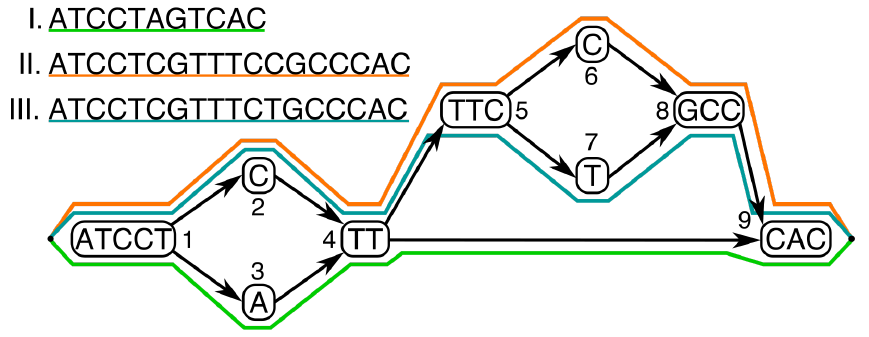
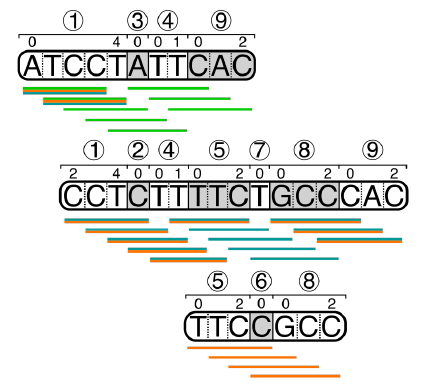

# CHOP: Phased path extraction from population graphs

## How to use

### Prerequisites

CHOP requires:

    - Python 2.7
    - networkx 1.9
    - bitarray

Input graphs should be directed and acyclic.

### Installing

```bash
git clone https://github.com/tomokveld/CHOP
cd CHOP
python setup.py install
```

You should now be able to call CHOP with:

```bash
chop
```

### Example usage

##### Running CHOP

In this example we run CHOP on a variation graph that encodes three haplotypes:




CHOP is called with *k* = 4 (-k 4), with haplotyping enabled (-H), running serially (-p 1), with an input graph in the GFA format from the examples directory, and outputting the *k*-paths in Figure_1_k4.fa.  

```bash
chop -H -k 4 -p 1 -g examples/Figure_1.gfa.gz -o Figure_1_k4.fa
```

##### Interpreting the output

CHOP outputs the haplotyped *k*-paths in the FASTA file, Figure_1_k4.fa, i.e. the null graph, in which each path is represented as a contig:

```txt
>1+0,5_3+0,1_4+0,2_9+0,3
ATCCTATTCAC
>1+2,5_2+0,1_4+0,2_5+0,3_7+0,1_8+0,3_9+0,3
CCTCTTTTCTGCCCAC
>5+0,3_6+0,1_8+0,3
TTCCGCC
```

How do these paths in the null graph relate back to the original graph? Every path comes in a pair describing an interval (`>` line) and a corresponding sequence. This interval describe the mapping of the path to corresponding nodes and nucleotide offsets. The notation of these intervals follows as `node`+`start_offset`,`end_offset` with `_` separating subsequent nodes.

Below is shown how the null graph (paths are shown in the same order as above) relates back to the original graph. The colored lines represent mapped 4-mers sampled from the original graph onto the null graph.



##### Read alignment

To map reads onto this null graph, you can pick your favorite linear reference aligner (here shown for BWA). First the null graph has to be indexed:

```bash
bwa index Figure_1_k4.fa
```

Once the null graph is indexed read alignment can follow, e.g.:

```
bwa mem Figure_1_k4.fa reads.fq > out.sam
```

The output SAM file can now be used for further downstream processing.

### Building compatible graphs from VCF files

At https://bitbucket.org/tomokveld/vcf-graph-gfa/ a script with documentation can be found to build graphs (.GFA) from input an input VCF file and FASTA file. 

For quick reference these output GFA files are formatted as:

```
H   VN:Z:1.0
H   BUILD:Z:VCF2GRAPHGFA
H   ORI:Z:sample1;sample2;REFERENCE
S   1   TTGACCGA...CCCACAG    *   ORI:Z:0;1;2 N:I:1700    START:i:0
S   2   T   *   ORI:Z:1;2   N:I:1   START:i:1700
L   1   +   2   +   0M
S   3   C   *   ORI:Z:0 N:I:1
L   1   +   3   +   0M
S   4   CATCGCCA...TGGAAA *   ORI:Z:0;1;2 N:I:119 START:i:1701
L   2   +   4   +   0M
L   3   +   4   +   0M
S   5   G   *   ORI:Z:1;2   N:I:1   START:i:1820
L   4   +   5   +   0M
S   6   T   *   ORI:Z:0 N:I:1
L   4   +   6   +   0M
```

### Surjecting graph alignments SAM files back to a linear reference

To simplify downstream analysis it can be helpful to map back to a single reference... TODO

### Projecting alignments back onto the variation graph

In `src/simple_chop_coverage.py` we give a simple example to map back alignment coverage onto the graph.

### Command line parameters

* -h, --help    Show a help message and exit
* -g GFA, --gfa GFA    Input GFA file
* -k KMER    k-mer value
* -o OUTPUT    Output file to write results
* -H, --haplotype    Use haplotype information in the graph
* -p PROCESSES    Number of processes to start (serial is default p = 1)
* -s PREFIX, --prefix PREFIX    Add an optional prefix for each path entry
* -e, --edge    Use if the haplotype annotations are on the edges rather than the nodes 
* -l {DEBUG,INFO,WARNING,ERROR,CRITICAL}  Set the logging level, for debugging purposes
* --version    Show program's version number and exit

## License

This project is licensed under the MIT License - see the [LICENSE.md](LICENSE.md) file for details.
